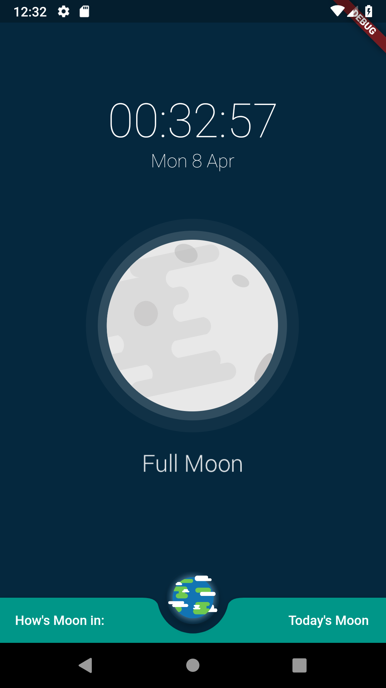

# How is Moon.

How is Moon is a digital clock combined with a moon phase calculator. It has a clean design that will not distract users if they place it on their desk at their workplace. It is aimed to be something subtle but useful.

## Usage
When you open the application, it shows the current time and the moon phase of the day. Users can check the moon phase of a particular day by clicking on the right bottom corner text/ date and result will be displayed from the moon in the centre screen. When users press on the Earth, it will bring them back to the moon phase of the current day. Users can also press on the moon to choose a specific moon phase for their digital clock. The animation will play and pause through presses.

## Contest
This application's initial commit is for Flutter Create Contest. I learnt Flutter for around 2 weeks and this app is designed and built in two days. All Dart code is in main.dart located in the lib directory and total size is 4961 bytes. The application by no means perfect and I would love to get some feedback from the judges if fesible. An animation of the Moon orbiting the Earth to show the Moon phrase is one of the features are planned to add in the future. 

## References
The moon phase calculation is referenced from https://www.subsystems.us/uploads/9/8/9/4/98948044/moonphase.pdf and it is just an estimation only.

## Screenshots

